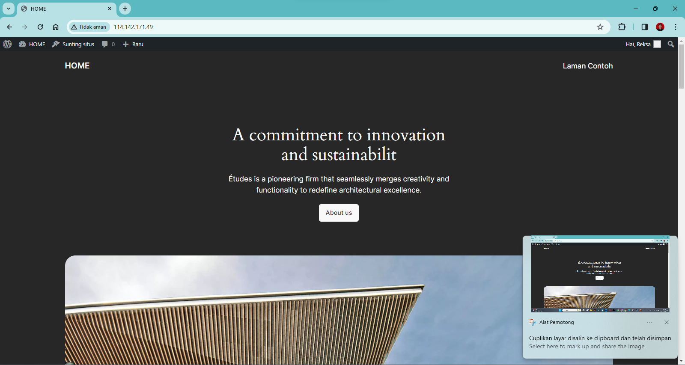

# Membangun Web Server Wordpress Dengan Centos server

## Apa itu Wordpress?
WordPress adalah sebuah aplikasi open-source yang sangat populer digunakan sebagai mesin blog. WordPress dibangun dengan bahasa pemrograman PHP dan database MySQL.

## Bahan-bahan yang perlu disiapkan:
- Virtualbox
- Iso Centos 7
- Jaringan internet

Bagi yang belum mempunyai iso dan juga virtualbox bisa di dapatkan disini :
- https://www.virtualbox.org/wiki/Downloads
- https://tecadmin.net/download-centos-7/
- https://www.centos.org/download/

## Alur installasi
- Membuat VM server centos dengan virtualbox

<code></code>

- Installasi Apache 

<code></code>

- Installasi 

<code></code>

- Install owncloud dengan docker-compose

<code></code>
